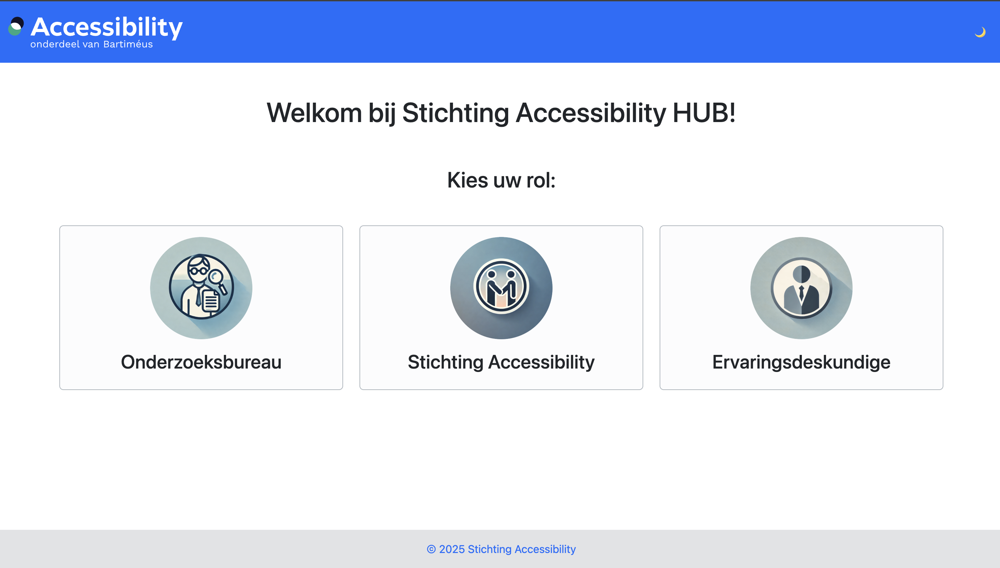
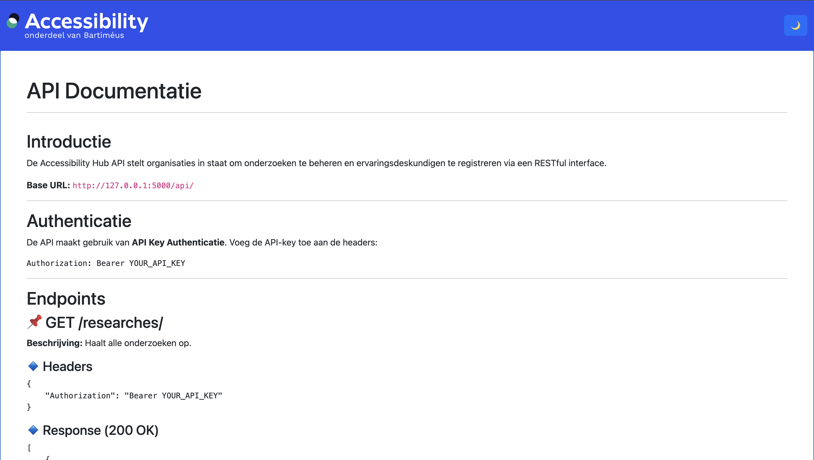

# 1b2 WP3 "Accessibility Hub"

Casus: [opdracht](CASUS.md)

## Installeren

### Stap 1: Installeer Python 3.12 (indien nog niet geïnstalleerd).

Ga naar de officiële Python-website en download de installer voor Python 3.12:
https://www.python.org/downloads/release/python-3120/

> [!warning]
> Zorg ervoor dat de optie **'Add Python to PATH'** is aangevinkt tijdens de installatie, zodat Python toegankelijk is via de terminal.

### Stap 2: Maak een locale kloon van de repository.

Clone de repository naar uw lokale machine door het volgende commando uit te voeren:

```shell
git clone https://github.com/Rac-Software-Development/wp3-2025-rest-1-b2.git
```

### Stap 3: Navigeer naar de repository-map.

Navigeer naar de map van de gekloonde repository:

```shell
cd wp3-2025-rest-1-b2
```

### Stap 4: Maak een virtuele omgeving aan.

Maak een virtuele omgeving aan om de benodigde Python-pakketten geïsoleerd te installeren:

```shell
python -m venv .venv
```

### Stap 5: Activeer de virtuele omgeving.

Activeer de virtuele omgeving die zojuist is aangemaakt:

```shell
#Windows
.\.venv\Scripts\activate

#macOS/Linux:
source .venv/bin/activate
```

### Stap 6: Installeer de vereiste pakketten.

Installeer de benodigde Python-pakketten door het onderstaande commando uit te voeren:

```shell
pip install -r requirements.txt
```

### Stap 7: Genereer de database

Om de SQLite-database aan te maken, kunt u het volgende commando uitvoeren:

```shell
flask init-db
```

Als u een database met dummydata wilt genereren, kunt u het volgende commando gebruiken:

```shell
flask init-db-data [factor]
```

Waarbij `[factor]` een **optionele** vermenigvuldigingsfactor is voor het aantal dummy records. Laat de parameter weg om
de standaardwaarde te gebruiken.


**Voorbeeld zonder factor:**

```shell
flask init-db-data
```

Dit commando maakt tussen de 10 en 25 dummy gebruikers en 5 tot 15 dummy bedrijven aan.


**Voorbeeld met factor:**

```shell
flask init-db-data 3
```

Dit commando genereert 100 keer zoveel dummy records als de standaarddatabase.

## Applicatie opstarten

Wanneer u zich in de virtuele omgeving bevindt, kunt u de applicatie starten met het volgende commando:

```shell
flask run
```
Open de browser en ga naar: http://127.0.0.1:5000 om de applicatie te openen.

Om de applicatie af te sluiten gebruik je `Ctrl+C`

En om je virtual environment te deactiveren gebruik je `deactivate`


## Homepage

Nu de applicatie is gestart bevind je je op de homepage. Op de homepagina heb je 3 opties:


### Onderzoeksbureau

Deze pagina is bedoeld voor medewerkers van de organisaties. Hier staat de documentatie van de API waarmee de medewerkers onderzoeken kunnen aanmaken, bekijken en kunnen bewerken.

### Stichting accessibility

Deze pagina's zijn bedoeld voor de medewerkers van stichting Accessibility (de admins). Als je naar deze pagina gaat, zul je eerst moeten inloggen:

De test inloggegevens voor deze pagina zijn 
- **gebruiksnaam**: admin
- **wachtwoord**: admin


Nadat je in hebt gelogd kom je in het 'admin dashboard' terecht. Hier kunnen de admins CRUD-acties uitvoeren op de onderzoeksaanvragen, inschrijvingen en ervaringsdeskundigen. Dit kan op twee manieren:

#### Goed- of afkeuren
Het goed- of afkeuren van onderzoeksaanvragen, inschrijvingen en nieuwe ervaringsdeskundigen moet via het 'keuren'-scherm:


Door op de 'details'-knop te drukken, word een kort overzicht van de gegevens van het onderzoek, inschrijving of ervaringsdeskundige getoond. Hier krijg je de optie om het gekozen object goed- of af te keuren:


Er zijn drie verschillende tabjes waarop je 'objecten' goed- of af kan keuren:
- Onderzoeksaanvragen:

- Inschrijvingen:
Geen screenshot beschikbaar
- Ervaringsdeskundigen:


#### Overige CRUD-acties
Het uitvoeren van overige CRUD-acties zoals het aanpassen/verwijderen van gegevens moet via het 'beheren'-scherm:


Door op de 'details'-knop te drukken, wordt een overzicht van alle beschikbare data van de ervaringsdeskundige, het onderzoek of de beheerder getoond. Hier kan je alle data aanpassen, waarna je door op de 'wijzigen opslaan'-knop te drukken de wijzigingen op kan slaan. Je kan ook het 'object' verwijderen door op de 'verwijderen'-knop te drukken.


Er zijn drie verschillende overzichten:
- Ervaringsdeskundigen:

- Onderzoeken:

- Beheerders:


### Ervaringsdeskundigen

Deze pagina's zijn bedoeld voor de ervaringsdeskundigen. Als je naar deze pagina gaat, zul je eerst moeten inloggen of moeten registreren:


#### Inlogpagina
Op deze pagina kan een (al goedgekeurde) ervaringsdeskundige inloggen met een email-adres en wachtwoord. Als de ervaringsdeskundige (nog) niet is goedgekeurd of is afgekeurd zal een foutmelding worden getoond.

Als je de database goed hebt gevuld bij het opstarten van de applicatie zou er een credentials.json bestand moeten verschijnen.


Hierin vind je test inloggegevens voor de ervaringsdeskundigen 


En met een van deze gegevens kan je inloggen bij de ervaringsdeskundigen 


#### Registerpagina
Op deze pagina kan een je een account aanmaken. Er moeten allerlei gegevens zoals voornaam, achternaam maar ook de beperkingen in worden gevuld. Hierna kan de je het account nog niet gebruiken. Dit kan pas nadat het goed is gekeurd door een admin.


#### Dashboard

Als je bent ingelogd kom word je verwezen naar de 'ervaringsdeskundige dashboard' pagina. Hier staan drie tabjes waar je onderzoeken kan zien.


Door op de 'details'-knop te drukken kan je een kort overzicht van de belangrijke data van het onderzoek zien.


Als je bent ingelogd als ervaringsdeskundige kan je ook je eigen gegevens bewerken. Dit doe je door bij de dropdown-knop op 'bekijk profiel' te klikken


Er zijn drie verschillende tabjes met onderzoeken:
- Open onderzoeken:
In dit tabje kan je de open onderzoeken zien waarvoor je je kan inschrijven.

- Mijn inschrijvingen:
In dit tabje kan je de onderzoeken zien waarvoor je je hebt ingeschreven.

- Beoordeelde onderzoeken:
In dit tabje kan je de onderzoeken zien waar je aan hebt deelgenomen en die zijn beoordeeld.

# RESTFUL API

Voor de restful API kan je de documentatie bekijken op de documentatie pagina op de website.



Klik op onderzoeksbureau om bij de documentatie te komen hierin staat precies uitgelegd hoe de api werkt. 



# SOURCES (Hamza-1034556)
- [data uit db ophalen met '___repr___' als debug methode](https://www.geeksforgeeks.org/sqlalchemy-mapping-python-classes/)   
- [forms and getElementById](https://stackoverflow.com/questions/15864606/forms-and-getelementbyid)                                                  
- [JavaScript String trim()](https://www.w3schools.com/jsref/jsref_trim_string.asp)
- [Show error using javascript]( https://stackoverflow.com/questions/27965834/show-error-using-javascript)
- [HTML DOM textContent Property]( https://www.w3schools.am/jsref/prop_node_textcontent.html#gsc.tab=0)
- [Form submit() Method]( https://www.w3schools.com/jsref/met_form_submit.asp)
- [HTML DOM Document addEventListener()](https://www.w3schools.com/jsref/met_document_addeventlistener.asp)
- [Generating API Key and Secret in Python 3]( https://dnmtechs.com/generating-api-key-and-secret-in-python-3/)                                
- [JavaScript Fetch API 1](https://www.javascripttutorial.net/web-apis/javascript-fetch-api/)
- [JavaScript Fetch API 2]( https://forum.freecodecamp.org/t/fetch-api-with-api-key/317584/3)
- [Get Header from API](https://stackoverflow.com/questions/68231936/how-can-i-get-headers-or-a-specific-header-from-my-backend-api?rq=1)
- [Session API](https://docs.sqlalchemy.org/en/20/orm/session_api.html)
- [How I Added Authentication to a Flask API With Decorators](https://blog.devgenius.io/man-how-i-added-authentication-to-a-flask-api-with-decorators-8ad82d92240c)
- [Decorators](https://flask.palletsprojects.com/en/stable/patterns/viewdecorators/)
- [Using authentication decorators in Flask](https://circleci.com/blog/authentication-decorators-flask/)
- [How to Add API Key Authentication to a Flask app](https://blog.teclado.com/api-key-authentication-with-flask/)
- [How to calculate the difference between two dates in JavaScript](https://www.scriptol.com/javascript/dates-difference.php)
- [Calculate age given the birth date in the format YYYYMMDD](https://stackoverflow.com/questions/4060004/calculate-age-given-the-birth-date-in-the-format-yyyymmdd)
- [Passing Bearer Token in Fetch Requests](https://apidog.com/blog/pass-bearer-token-fetch-requests/)
- [SQLAlchemy declerative tables](https://docs.sqlalchemy.org/en/20/orm/declarative_tables.html)
- [SQLAlchemy tables and models](https://flask-sqlalchemy.readthedocs.io/en/stable/models/)
- [SQLAlchemy quick start user guide](https://flask-sqlalchemy.readthedocs.io/en/stable/quickstart/#define-models)
